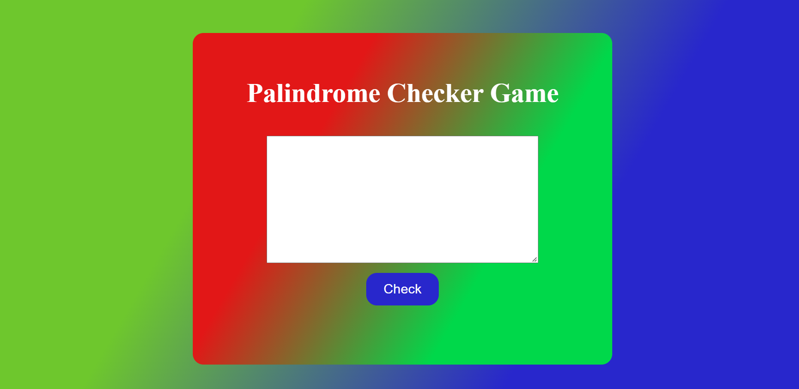
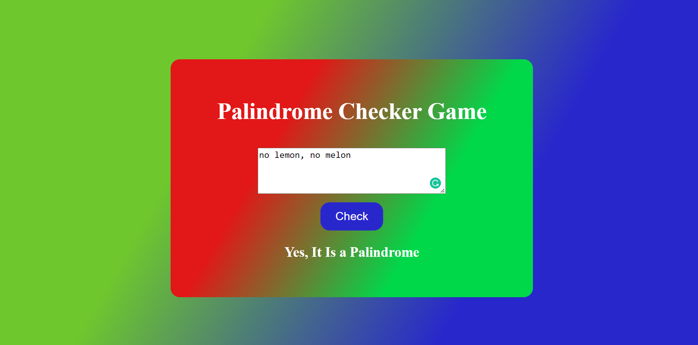
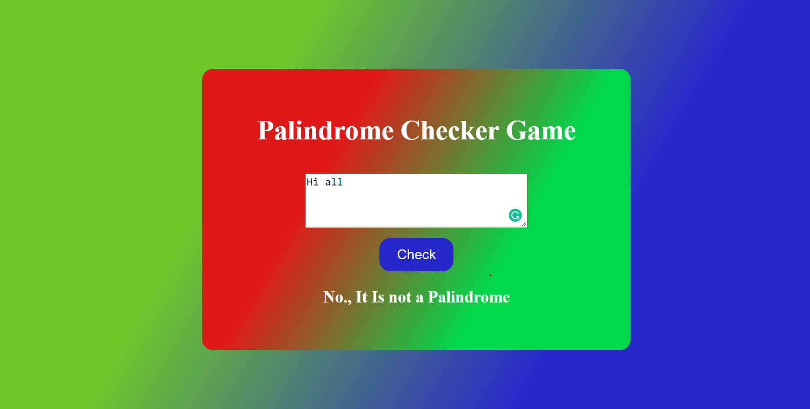

## What to build

we have to Build Palindrome Checker Game.

## Input

## Techanology used

we have used HTML, CSS and JavaScript DOM

## What I have learned from this project

I have learned how to Check a string, word or number is palindrome or not and also learned how to use reguler expression.

## Output

### Palindrome Test Pass Output

### Palindrome Test Fail Output

### Instructor

**Hitesh choudhary**
